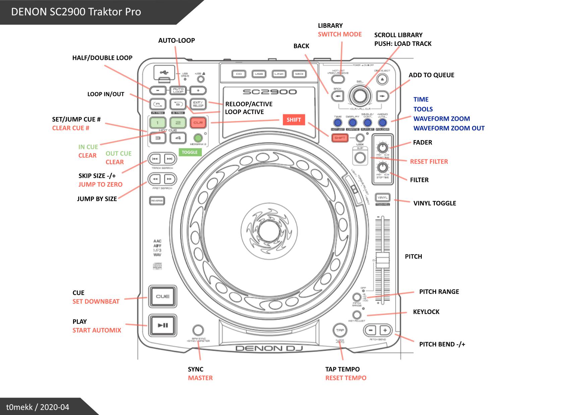

# DENON SC-2900 MIDI MAP 
## for TRAKTOR 3 PRO

Based on original DN-SC2900 mapping

# Features

	* 1-8 Hotcues
	* basic track info display (VFD)
	* 16 beats jump
	* Next/prev hotcue
	* Layout switch
	* Waveform zoom in/out
	* Cue button blink on beat
	* ...

# Mappings

	* SHIFT + SEARCH 			- jump 16 beats
	* SHIFT + LOOPSIZE +/-		- move active loop
	* SHIFT + HOT LIST			- add to Preparation List
	* SHIFT TOGGLE + SEARCH 	- next/prev hotcue
	* MIDIBANK 2 (toggle)		- hotcues 5-8
	* SHIFT TOGGLE + HOT LIST	- change layout
	* STOP TIME					- waveform zoom
	* SHIFT + AUTOLOOP			- deck A&B advanced view
	* SHIFT + SYNC				- tempo master

# To-Do

  * Fix hotcue leds sometimes doesn't light up
  * Sampler controls (rec/del/set/play)
  * Add controls for quantize, snap, auto-grid etc.

# Other info

  - don't use "Blend" when mapping Out LEDs
